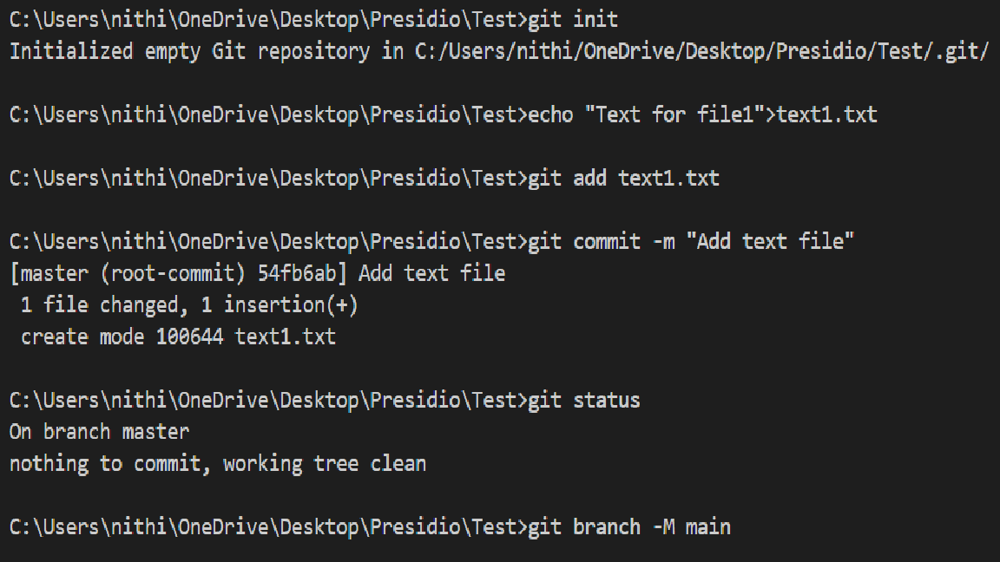
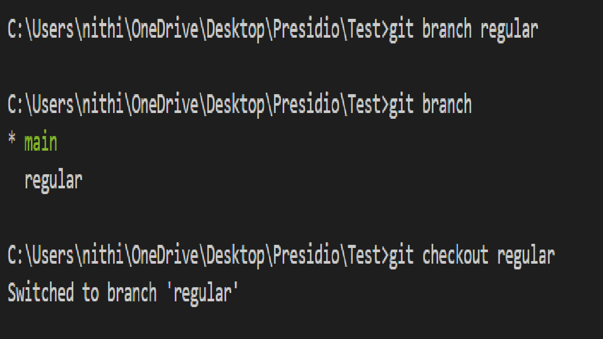
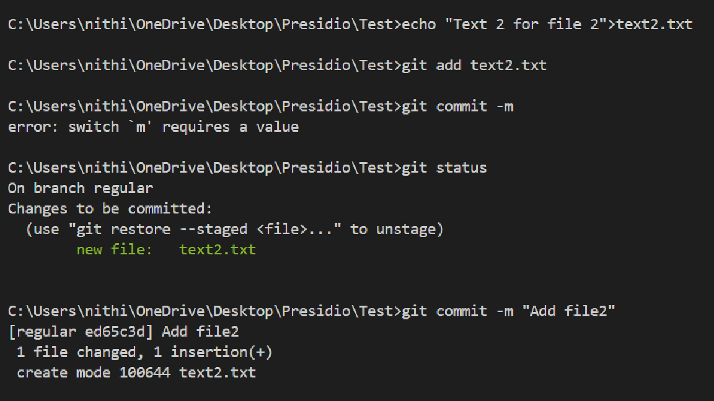
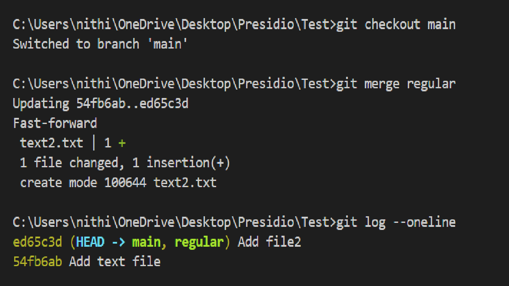

# Initialize, Commit, and Branch Basic

## Objective
- Initialize a new Git repository.
- Create a few files and commit them.
- Create a new branch, make changes, and merge it back to the main branch.

## What I did

```bash
git init
echo "Text for file1">text1.txt
git add text1.txt
git commit -m "Add text file"
git status
git branch -M main
```

- `git init` used to initialize the repository 
- `echo "...">text1.txt` , It will create a .txt file with some texts
- `git add text1.txt` used to stage the text file which is ready to commit
- `git commit -m "Add text file" ` used to commit the changes to the repo with commit message
- `git status` used to show the untracked and unstaged files in directory
- `git branch -M main` used to rename the current branch (master) to main.



```bash
git branch regular
git branch
git checkout regular
```

- `git branch regular` used to create new branch(regular). 
- `git branch` used to show all the branches and show the current pointed branch
- `git checkout regular` used to change branch from one to another



```bash
echo "Text 2 for file 2">text2.txt
git add text2.txt
git commit -m "Add file2"
```

- Now in the regular branch,
- These commands will create text2 file.
- Staged and committed the file to regular branch.



```bash
git checkout main
git merge regular
git log --oneline
```

- Switched to main branch
- `git merge regular` used to merge regular branch with main branch
- `git log --oneline` used to show the history of commits

