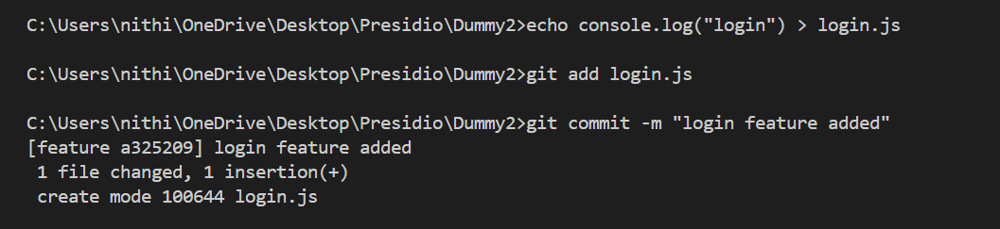
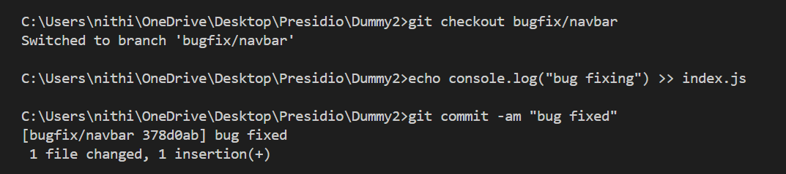
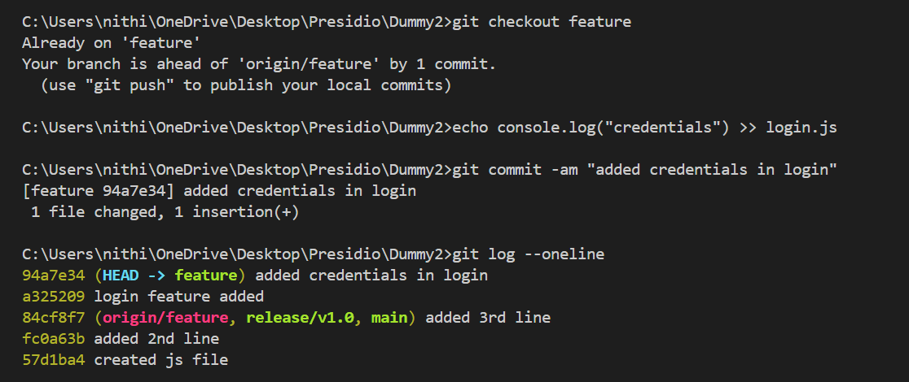
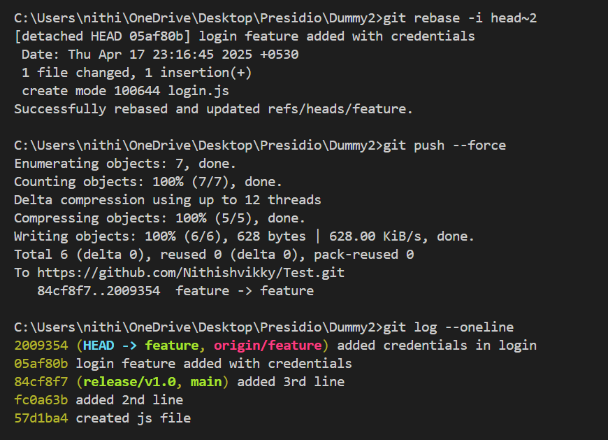
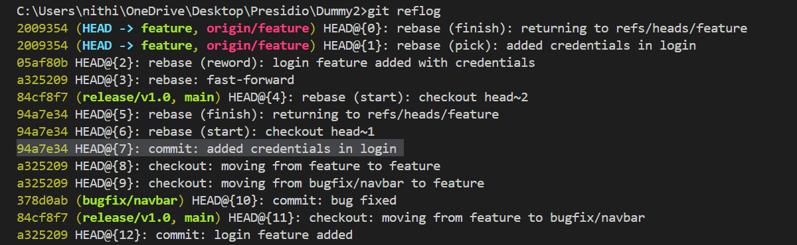
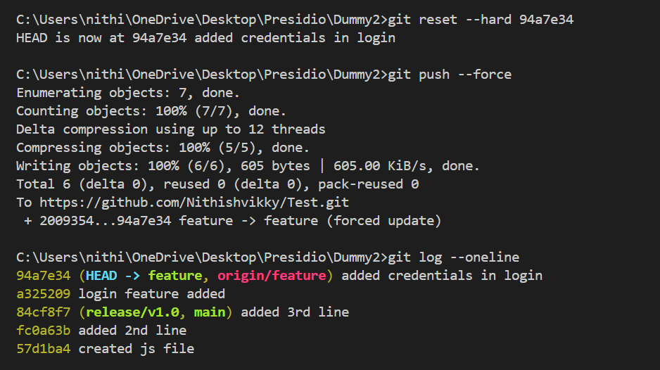
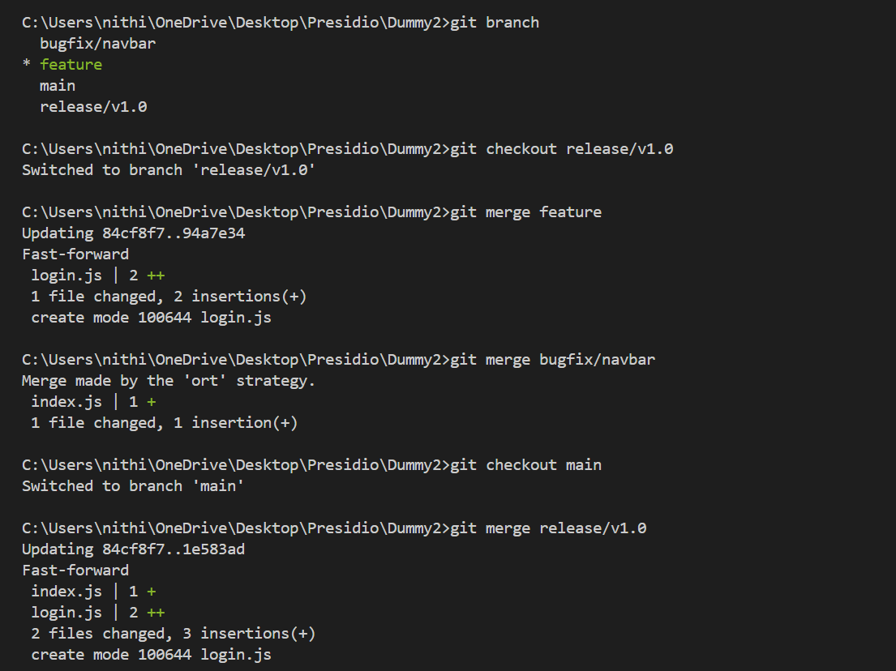

# Comprehensive Workflow with Forced Pushes and Recovery

## Objective
- Simulate an advanced Git scenario that includes forced pushes, recovering lost commits, and a multi-branch workflow.

## Workflow of this task
- Here I created `main`, `feature`, `bugfix/navbar` and `release/v1.0` branches.
    - `main` – This is the main branch. It holds the final and stable code.
    - `feature` – Used for adding new features. (In this case, I added a `login.js` file.)
    - `bugfix/navbar` – Used for fixing bugs. (I added a fix in the `index.js` file.)
    - `release/v1.0` – This branch prepares the code for version 1.0 release. We merged both the feature and bugfix here before going to main.
- I simulated scenario where I should use forced pushes. For that, I changed the commit history by rebasing it and pushed it by force.
- After pushing it by force, I realized that I pushed the wrong change and there was no way to return to the previous commit.
- Now, the lifesaver command `git reflog` helped me recover that commit and reset the commit history.

## What I did

### 1. Multiple branches

- main
- feature
- bugfix/navbar
- release/v1.0

### 2. Added features in **feature** branch

- Created **login.js** and added the login feature.
- Staged those changes in the **feature** branch.

### 3. Fixed bugs in navbar in **bugfix/navbar** branch

- Fixing the bug in **index.js**.
- Staged those changes in **bugfix/navbar** branch.

### 4. Added properties in **login** in **feature** branch

- Added **credentials** in the **login.js** file.
- Staged those changes.
- Logged the **commit history** and wanted to change the **commit message** of the previous commit(`Head~2`) in **feature** branch.

### 5. Rebasing the commit

- Wanted to change the **commit message** of previous commit(`Head~2`) in the **feature** branch, which altered the **commit history**.
- By using `reword`, it could be renamed.

- This changed the commit history, which didn't match the **remote repo**.
- So, I had to force push it to the **remote repo** from the **local repo**.
- You can see in the log of **feature** branch, There is no history of the previous commit(`a325209` login feature added).
- The commit ID `a325209` was replaced by a new commit ID `05af80b`, along with a new message.

### 6. Recovered the commit by using lifesaver

- I realised that I pushed the wrong change and needed to return to the previous commit.
- Here, `reflog` helped me to find that commit ID. It contains the history of all the commits.
- It's like a timeline view of Git.
- I had to return to the previous commit before the **rebase**.

### 7. Found the lost commit ID and returned to it

- I switched back to the previous commit before the rebase.
- Then I force pushed it to the **remote repo**.
- After that, I logged the branch history again.
- Now, you can see that  I successfully returned to the previous state.

### 8. Multi-branch workflow

- I worked on features in the `feature` branch.
- I fixed bugs in the `bugfix/navbar` branch.
- I merged both `feature` and `bugfix/navbar` into `release/v1.0`.
- A `release/v1.0` branch is used to stage and test everything before release.
- I merged `release/v1.0` back into `main`, which now includes both the feature and the fix.
- This ensures the `main` branch stays up to date with tested and finalized changes.

### Best Practices for Rewriting History & Using Force Pushes

- Avoid force pushing to shared branches like `main` or `release` unless absolutely necessary.  
- Use `git push --force-with-lease` instead of `--force` to avoid overwriting others’ work unintentionally.  
- Create a backup branch or tag before rebasing or resetting.  
- Use `git reflog` to locate and recover lost commits after rewriting history.  
- Keep commit history clean and meaningful before merging into main or release branches.  

