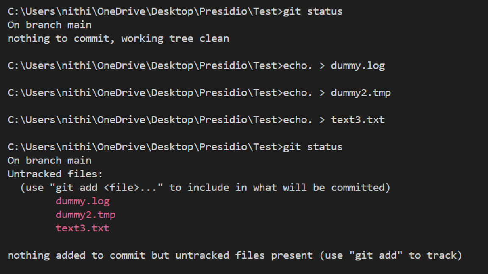
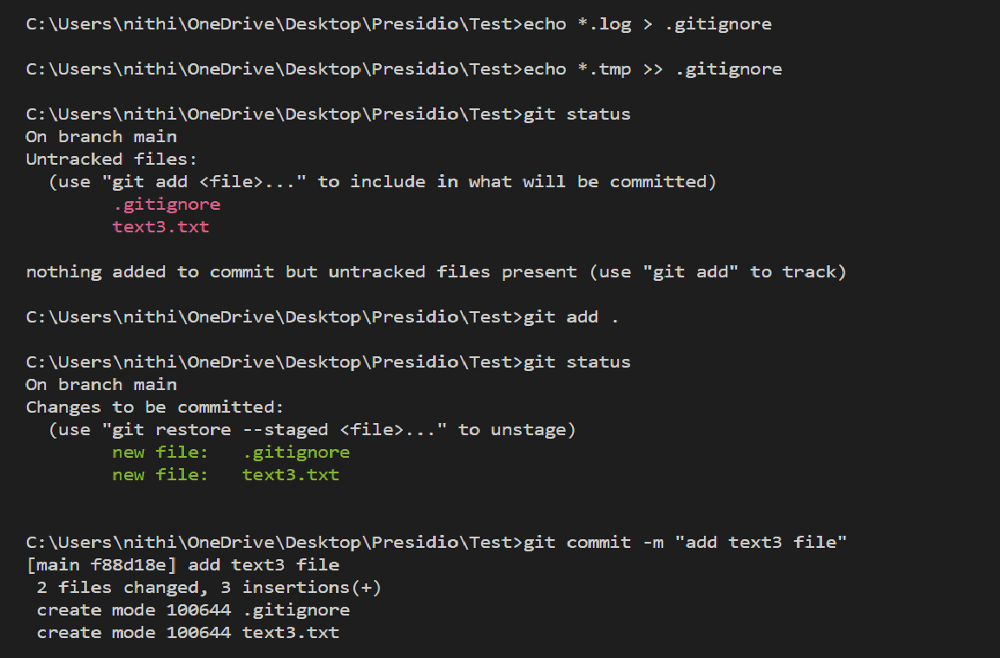
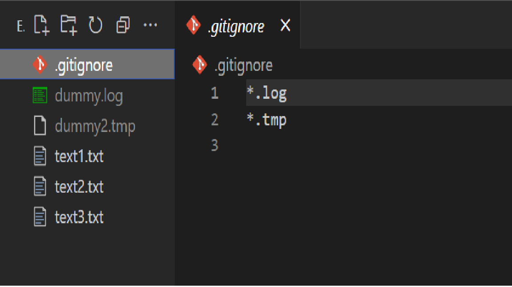

# Using .gitignore and Tracking Files

## Objective
- Set up a `.gitignore` file to exclude certain files or directories.
- Verify that ignored files are not tracked by Git.


## What I did

```bash
git status
echo. > dummy.log
echo. > dummy.tmp
echo. > text3.txt
git status
```

- `git status` used to show the untracked and unstaged files in the directory.
- `echo. > .log` , Created .log, .tmp and .txt files
- Now, These three files are untracked but I want to stage the .txt file and ignore .log, .tmp files.



```bash
echo *.log > .gitignore 
echo *.tmp >> .gitignore 
git status
```

- `echo *.log > .gitignore` , It'll create .gitignore file with the ***.log** line.
- `echo *.tmp >> .gitignore` , It'll append ***.tmp** line in the .gitignore file
- `.gitignore` configuration file used to avoid the unnecessary or sensitive files (log, env and tmp) from being tracked in a repository.
- By `git status`, You can see those two dummy files(dummy.log, dummy2.tmp) are ignored and not shown by this command.



### .gitignore config file



