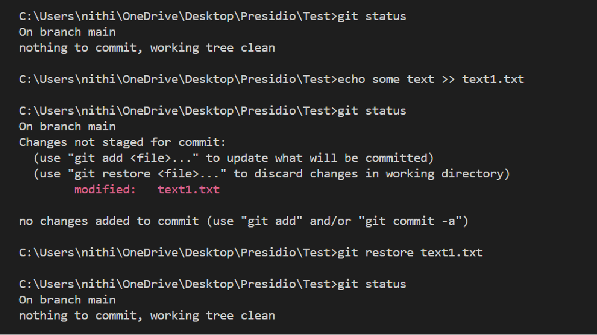
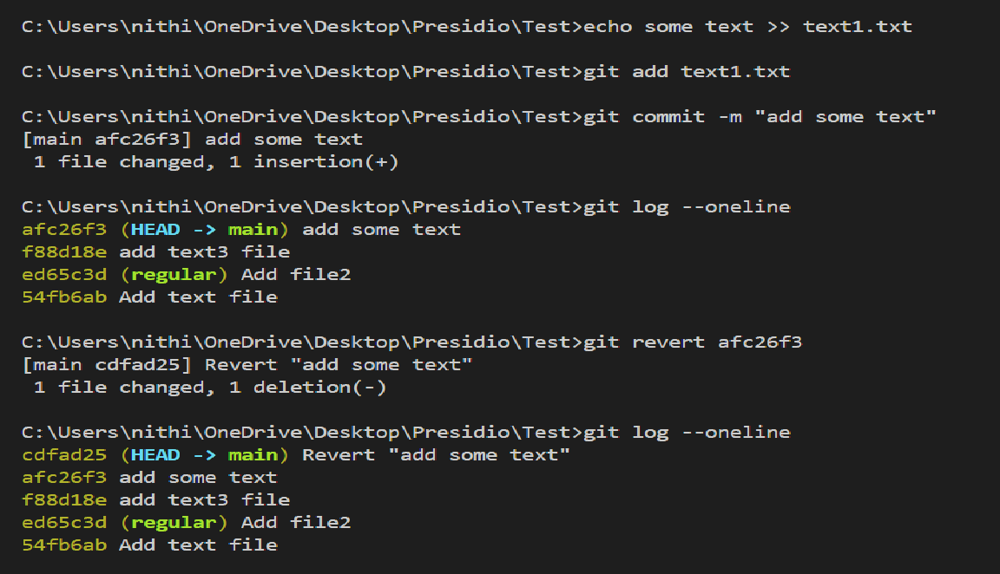
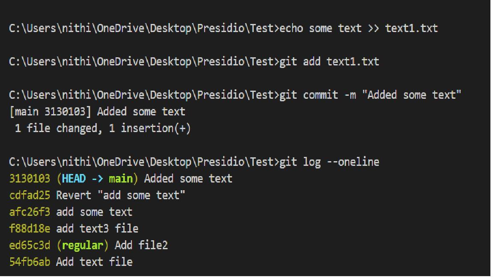
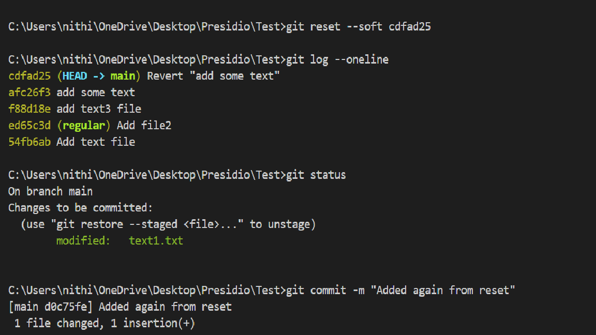
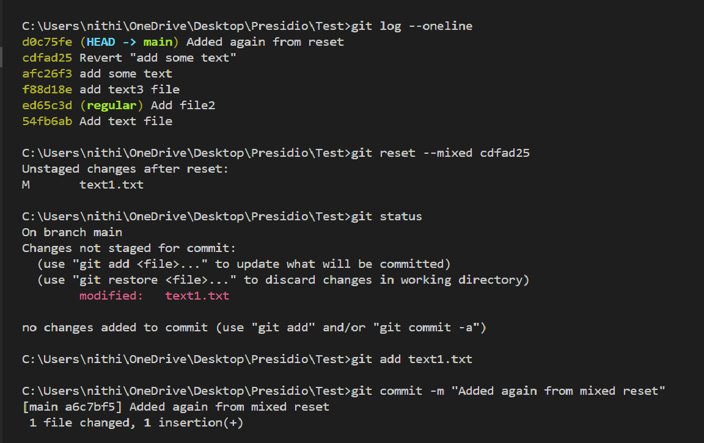
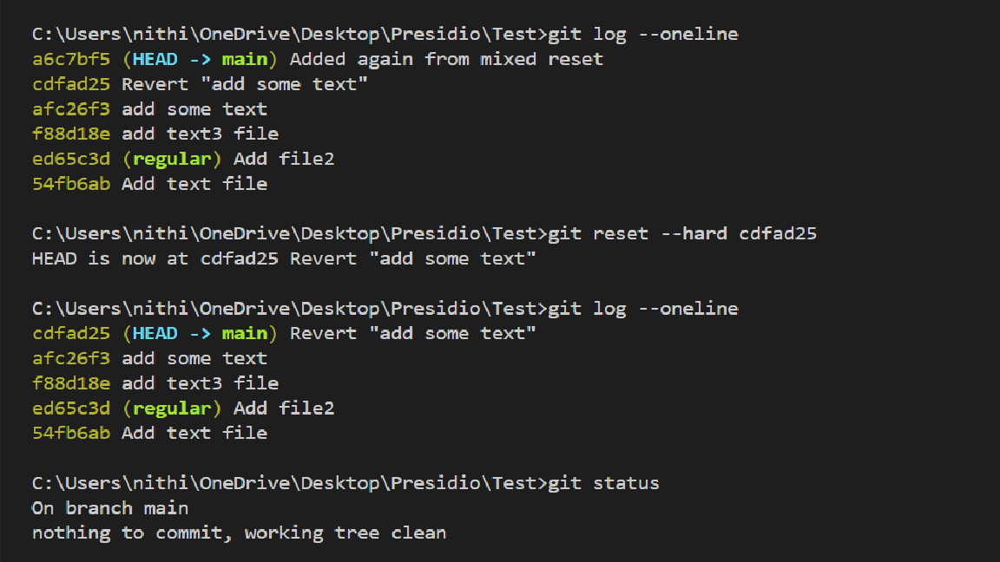

# Undoing Changes and Reverting Commits

## Objective
- Experiment with undoing changes in your working directory and commits.


## What I did

### Undoing Changes (Before commit)

- Undoing changes from the tracked files.
- `git checkout -- <file_name>` and `git restore <file_name>` are used to discard the **uncommitted changes** in a files.

```bash
echo some text >> text1.txt
git restore text1.txt
```

- `git status` shows that **text1.txt** file modified yet to stage it.
- To undo the changes from **text1.txt**, `git restore text1.txt` is used.
- Now `git status`, shows that nothing to commit.



### Undoing changes - Reverting changes (After commit)

- Used to revert the commits by using **revert** and **reset**.

```bash
echo some text >> text1.txt
git add text1.txt
git commit -m "add some text"
git log --oneline 
git revert afc26f3
git log --oneline 
```

- Now added some text to **text1.txt** file and committed it.
- Note commit id `afc26f3`, Head is pointing this id. So, This id can be specified as head in command `git revert afc26f3`/ `git revert head`
- Now we can see in the log, Revert created the new commit and didn't affect the commit history.
- And also undo the changes.



```bash
echo some text >> text1.txt
git add text1.txt
git commit -m "added some text"
git log --oneline 
```
- Again committed to use other method **reset**.
- This method affect the commit history like it will remove the commit which is being pointed by head.
- Note Head (`3130103`) and previous commit id Head~1(`cdfad25`)



```bash
git reset --soft cdfad25
git add text1.txt
git commit -m "added some text"
git log --oneline 
```
- Head~1 (`cdfad25`) previous commit id.
- Here trying to reset to the previous commit from current(head).
- `--soft` will keep the changes in the working directory and staging area yet to commit.



```bash
git reset --mixed cdfad25
```
- `--mixed` will keep the changes in the working directory but removes the changes from staging area.



```bash
git reset --hard cdfad25
```
- `--hard` removes the changes from both staging area and working directory.




### difference between **revert** and **reset**

- Major difference is that revert won't affect the commit history instead it will make another commit for revert.
- Whereas, reset affect the commit history and point head to the specified commit id.