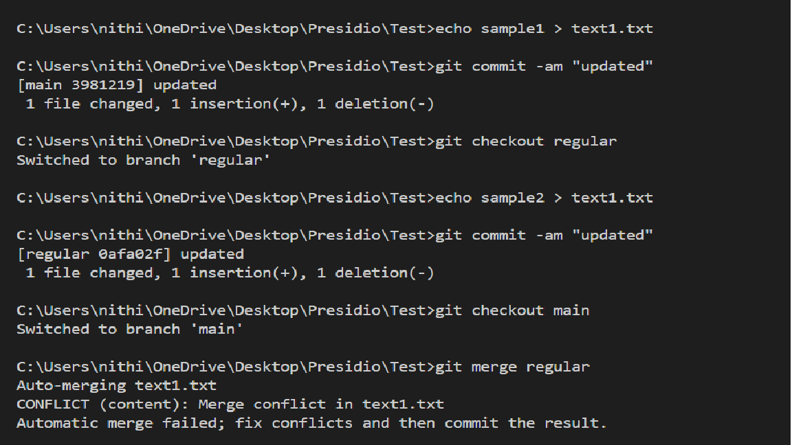
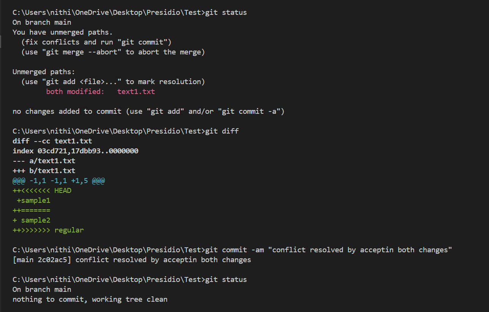
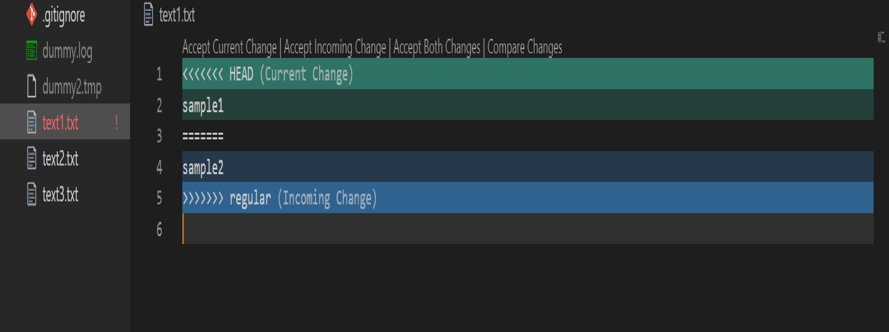

# Simulating and Resolving Merge Conflicts

## Objective
- Create a scenario that produces a merge conflict and resolve it.


## What I did

- Merge conflict occurs when the user try to merge branches when same file modified in both branches.

```bash
echo sample1 > text1.txt
git commit -am "updated"

git checkout regular
echo sample2 > text1.txt
git commit -am "updated"

git checkout main
git merge regular
```

- `git commit -am "updated"` **-am** used to add and message.
- Here I modified **text1.txt** file in both branches and tried to merge **regular** branch from **main**.
- Now merge conflict occurs, can see it in below image.



```bash
git status
git diff
```

- `git diff` used to see what are all the changes made in **text1.txt** file.
- Here you can see the changes and resolve it by manually changing it in text1.txt file.
- Conflict resolved then add and commit it.




- Current change is current branch's(**main**) change and incoming change is another branch's(**regular**) change.



