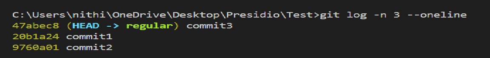
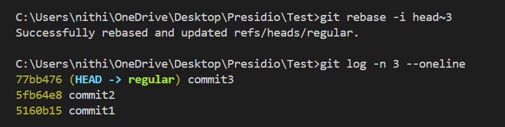
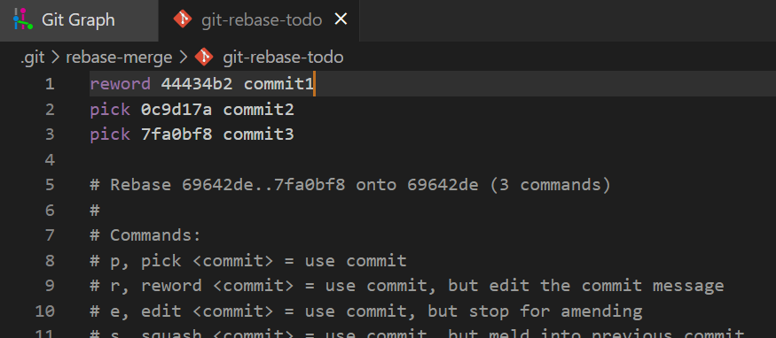
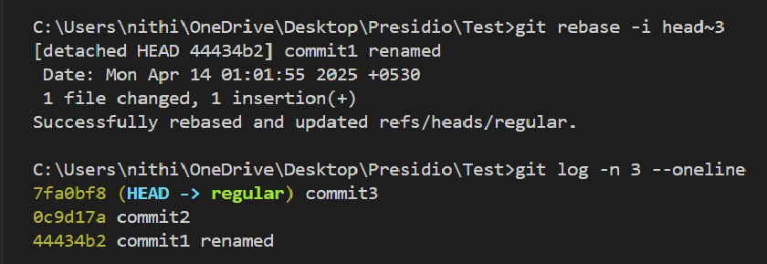
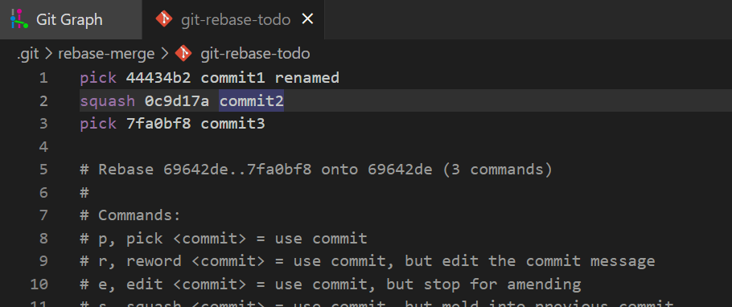
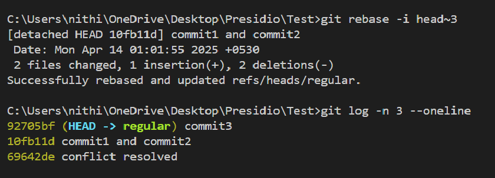

# Interactive Rebasing for Clean Commit History

## Objective
- Use interactive rebase to tidy up your commit history.

## What is Rebase

- `rebase` is used to interact with the commmit history.
    - edit : Used to edit the commit what we have done in that specific commit
    - reword : Used to change the commit messages
    - pick : Used to pickup the remaining commit which we don't want to change anything
    - squash : Used to squash multiple commits as one

- Last 3 commit which I am going to work and can see the commit order.

- Going to reorder the commit1 and commit2
- **Note** : If these reordering commits related to the same file, It'll be conflict have to resolve it.

- Going to change the commit message of commit 1
- By put `reword` , It'll open the **commit message** config. There you've change the message

- Log of last 3 commits where commits are reordered and renamed by me.

- Here I am going to squash commit 1 and commit 2 using `squash`.

- Can See the squashed commits with another commit mesaages in the log

### Importance of squash in cleaning up commit history
- Combines small commits into one clear commit.
- Makes the commit history clean and easy to read before merging into main.

