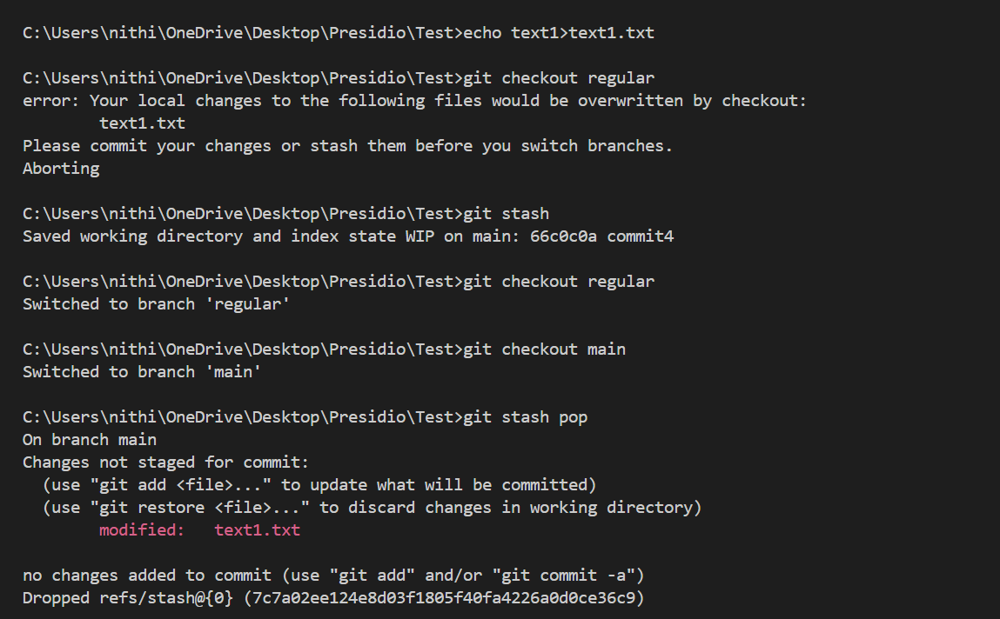
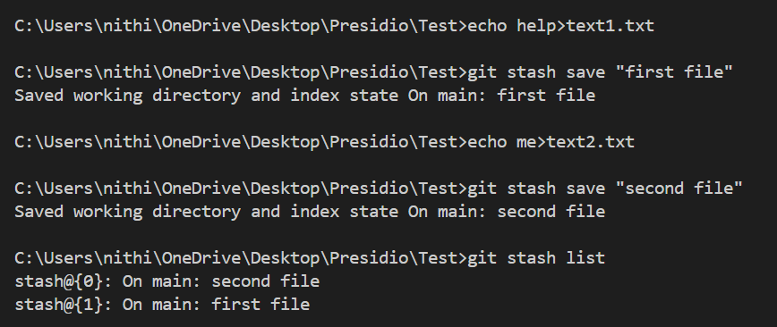
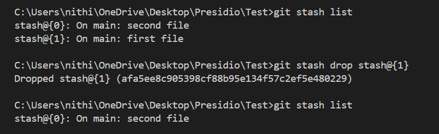

# Stashing Changes for Context Switching

## Objective
- Learn how to use Git stash to save uncommitted work temporarily.

## What is stashing?

- As mentioned in the objective, To save the uncommitted changes temporarily in the `stash` before switching to other branch.
- Git won't allow you to switch to another branch before committing changes. In that case, `stash` will help.
- `stash` works like `stack`.

## Working

- I changed in **text1.txt** file and switched to another branch(**regular**) without committing these changes.
- Git gave an error.
- So, I used `git stash` to save them temporarily.
- When I comeback to **main** branch, `git pop` to pop out latest stash.

- Now I used to `git stash save ""` to save the stashes with messages.
- `git stash list` will show the list of all the stashes in the branch.

- `git drop stash@{n}` used to drop the specific stash from stash list which mentioned using the index(**n**).
- `git clear` will clear the entire stash list.

### Commands

- `git stash` : Used to stash
- `git stash save ""` : Used to save with messages
- `git stash list` : Used to show the stash list
- `git stash pop` : Used to apply the stash and remove it from the list
- `git stash apply` : Used to apply the stash but keeps it in the list
- `git stash drop` : Used to drop it from the list without applying it
- `git clear` : Used to clear the entire stash list