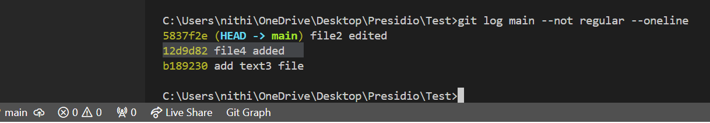
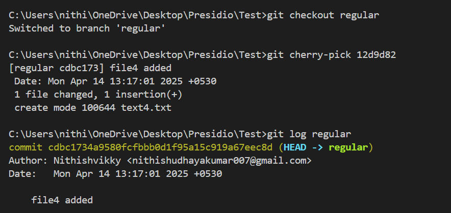
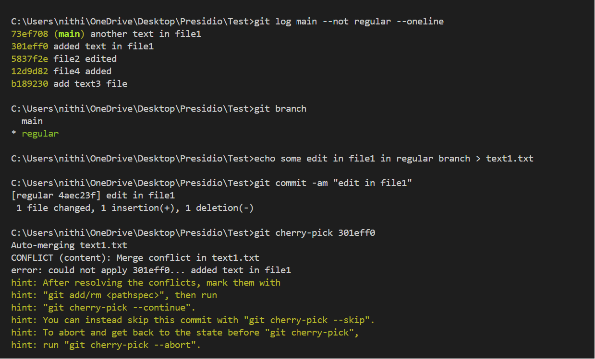
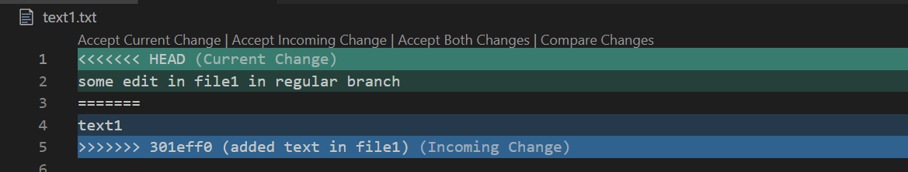

# Cherry-Picking Commits Between Branches

## Objective
- Selectively apply a commit from one branch to another using cherry-pick.

## What is cherry-picking?

- Picking a specific commit from another branch to apply in the current branch without the need of merge.
- If that commit affect the same file lines in current branch which also have committed changes, It'll raise the conflict.

## What I did

- **main** branch log history is visible in the below image.
- In this branch, I changed committed 2 exisiting files and also created one file(**12d9d82 "file4 added"**).

- I wanted to pick that commit alone(**12d9d82 "file4 added"**) from **main** branch to **regular** branch without merging it. So, I used `git cherry-pick <commit-id>`.

- What if it'll raise the conflict.
- Now, I committed changes in **main** branch in **file 1**.
- Switched to **regular** branch and committed changes in same **file1**.
- Now, Tried to pick that commit from **main** branch to **regular** branch.
- Here, It throws the conflict. Then as usual resolve the conflict and commit it.

- Accept the changes according to the wish to resolve the conflict.

