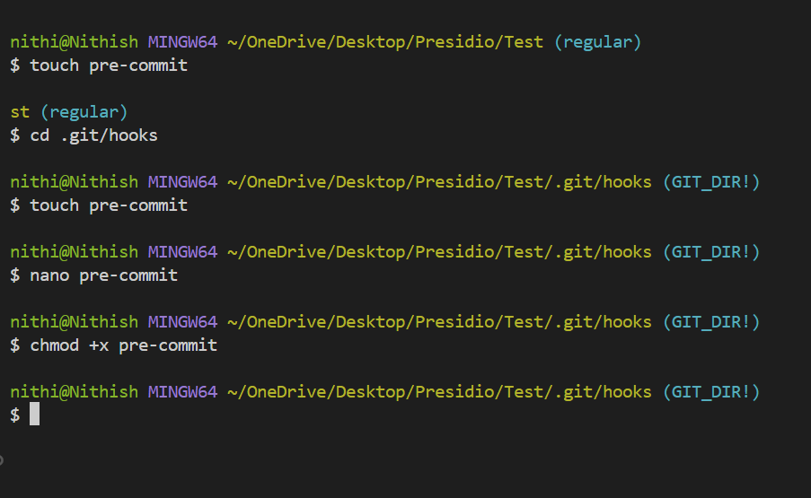
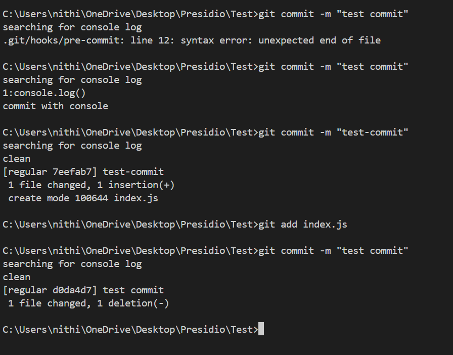

# Using Git Hooks for Automated Checks

## Objective
 - Set up a Git hook to run scripts (like linters or tests) before commits are finalized.

## What is Git hooks?
- Git hooks are custom scripts that Git automatically executes before or after specific Git operations like commit, push, or merge.

    - pre-commit: Before a commit is finalized.
    - pre-push: Before code is pushed to a remote.
    - commit-msg: When a commit message is created.

## What I did

- Navigate to the directory

```bash
cd .git/hooks
```
- Create pre-commit hooks in this directory

```bash
touch pre-commit
```

- If you want to edit a file called pre-commit inside your Git hooks folder:
- This opens the file in the terminal using the nano editor.

```bash
nano pre-commit
```

- Write script code in the nano editor .
- If the **.js** file contains `console.log`, It'll abort the commit with `commit with console` message with non-zero return value.
- If it don't contain `onsole.log`, It'll commit it with `clean` message with zero return value.

```bash
#! /bin/bash

echo "searching for console log"

if git diff --cached --name-only| grep '\.js$' | xargs grep -n "console\.log";then
	echo "commit with console"
	exit 1
fi
	echo "clean"
	exit 0

```

- By default, newly created files don’t have executable permissions.
- Without `chmod` , git will skip it.
- Running this will give permission to user to run it.

```bash
chmod +x pre-commit
```



- Now, Trying to commit **.js** (`index.js`) file with `console.log`.
- Then, Trying it without `console.log`



## Git helps to improve code quality

- Git hooks are custom scripts that Git executes automatically at key points in workflow such as before committing, pushing, or merging code.
- Key Points :
    - Code Consistency
    - Bug Prevention
    - Avoid Broken Commits
    - Standardized Workflows
    - Automation


