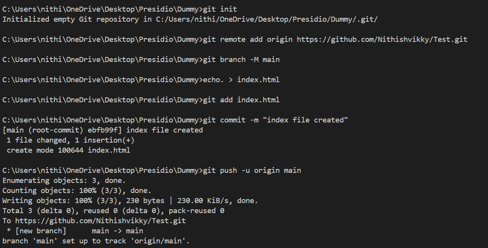
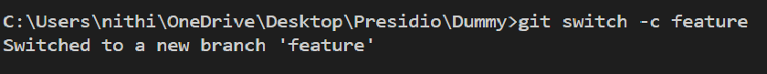
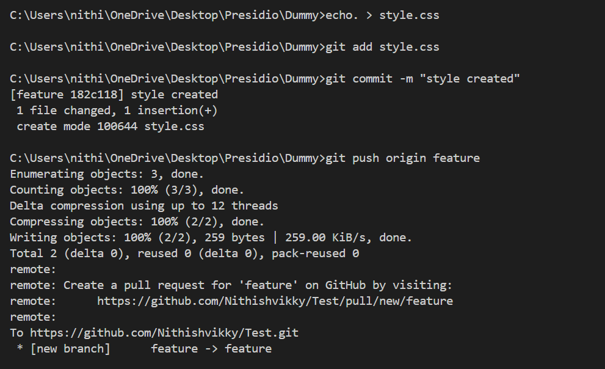
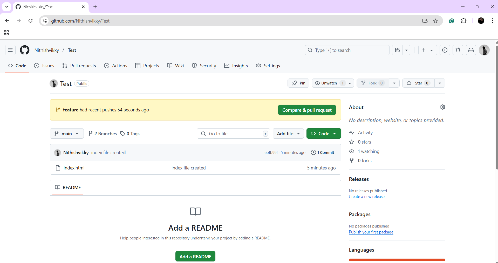
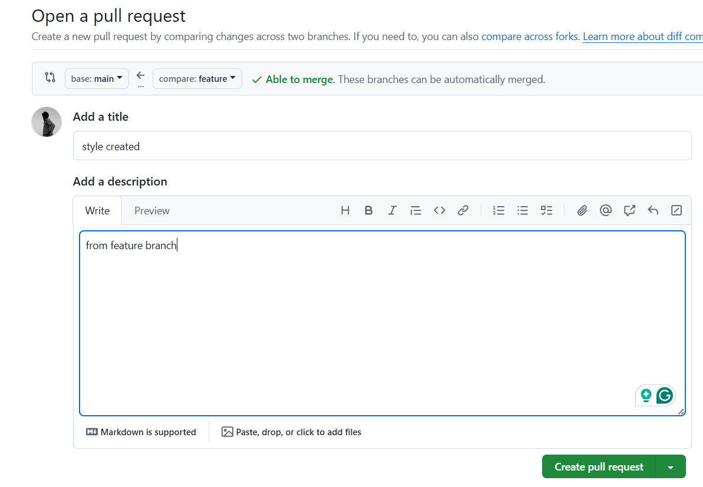
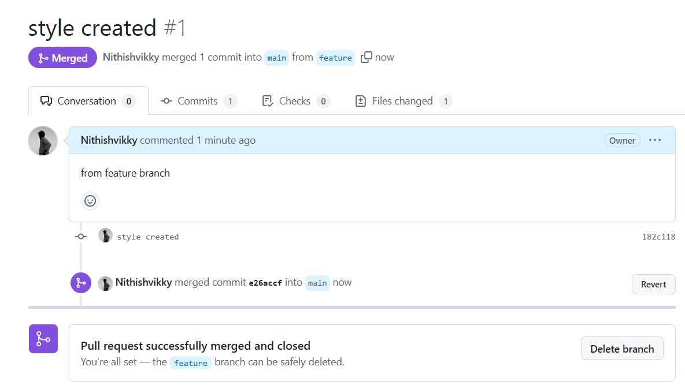
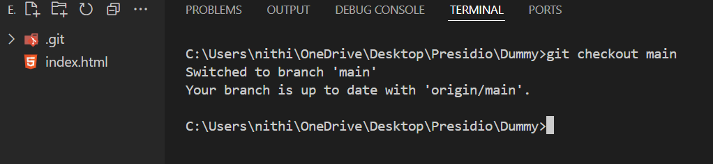
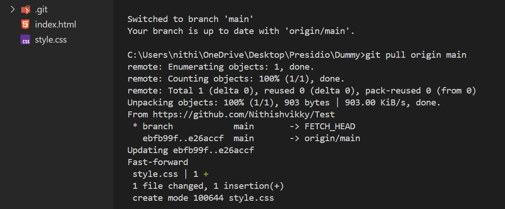

# Working with Remote Repositories and Collaboration

## Objective
- Simulate a collaborative workflow with remote repositories.

## Remote service

- Remote services refer to cloud-based tools and platforms that developers use to collaborate, share, and manage code—even if they're in different cities, countries, or time zones.
- GitHub, GitLab, Bitbucket, CI/CD platforms (like GitHub Actions, Jenkins), cloud storage, deployment tools, etc.

## What I did

- As usual initialize the local repository.

```bash
git init
```

- Now, Connect the local repository with remote repository.
- `origin` is a remote-name
- `https://github.com/Nithishvikky/Test.git` is a remote url.

```bash
git remote add <remote-name> <remote-url>

git remote add origin https://github.com/Nithishvikky/Test.git
```
- Rename the branch name to main by using **-M**.
- Create **index.html** file to repository.
- Statge this file in `main` branch.
- Now, push this to remote repository using,

```bash
git push -u origin main
```




- Now, Create and switch to another branch(**feature**).



- Create **style.css** file in feature branch and stage it.
-  Now, push it to remote repository using,

```bash
git push -u origin feature
```



- Go to remote repository which is in the GitHub.
- There is a merge request from the local repository.
- Give **Compare & pull** request.



- Add title and description then create pull request.
- It checks for any merge conflicts.



- Now, give **Merge request** with proper merge message.
- It'll be shown in the remote repository.



- So, Switch to main branch.




- Merged the **feature** with **main** in the remote repoistory not in local repository.
- Now, Have to pull the changes from remote repository to local repository.
- By using,

```bash
git pull origin main
```

